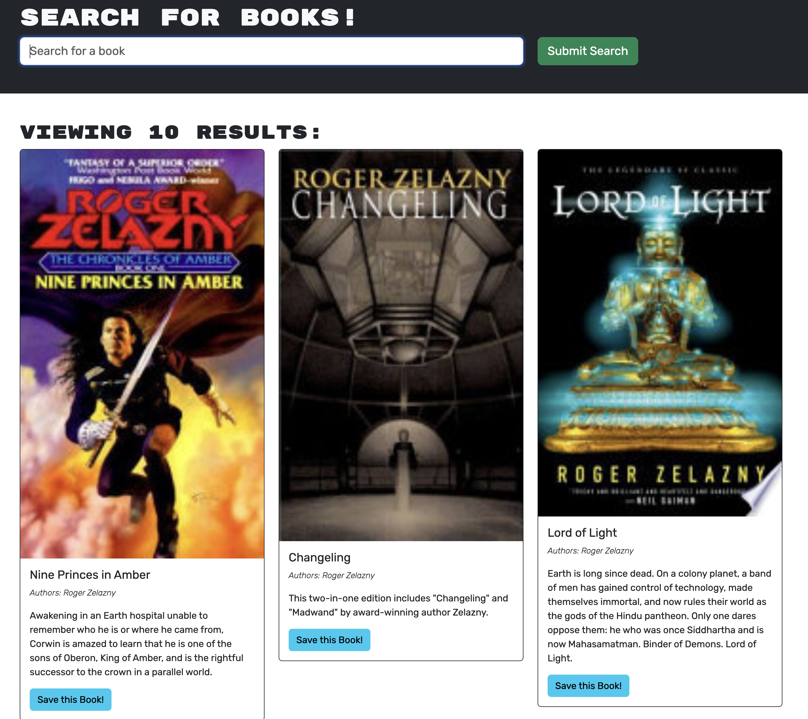
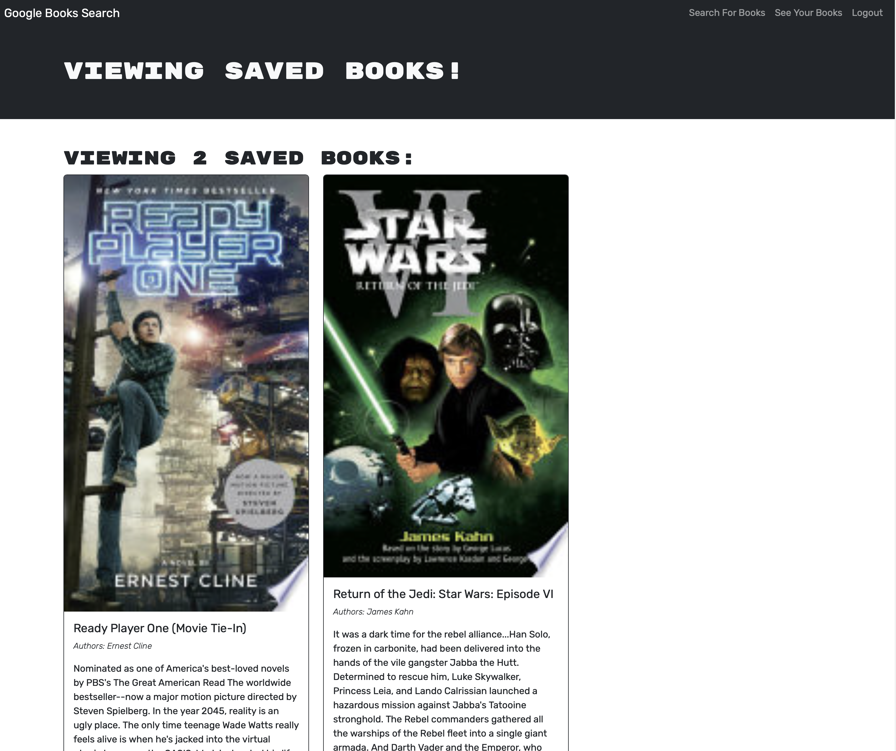

# Book Search-n-Save

## Description
This is a simple app to save the results of book searches. It is a full-stack MERN app that was refactored from RESTful to GraphQL APIs.

## Deployment
This app has been deployed to Render:

<https://book-search-n-save.onrender.com>

Note that I am currently using the free tier so it may take up to minute to spin up on first access.

## Use
The initial home page is the search page; you do not need an account to search for books, but you must create one (or login if you have already done so) in order to save the results. The screenshot below shows the first three results of a search for "Zelazney".

If you are not logged in, the "Save this Book" buttons do not appear. After saving a book if you click on the "See your books" menu, you are presented with a list of saved books, such as the one shown in the screenshot below.

You may remove any individual book from a saved list by clicking the "Delete this Book" button. Saved book lists are specific to a user, and persist across login sessions.

## Questions
Reach out if you have questions that are not covered here!

- GitHub username: clstevenson
- email: chrislstevenson@gmail.com

## License
This project is licensed under the terms of the [MIT license](https://opensource.org/licenses/MIT).
